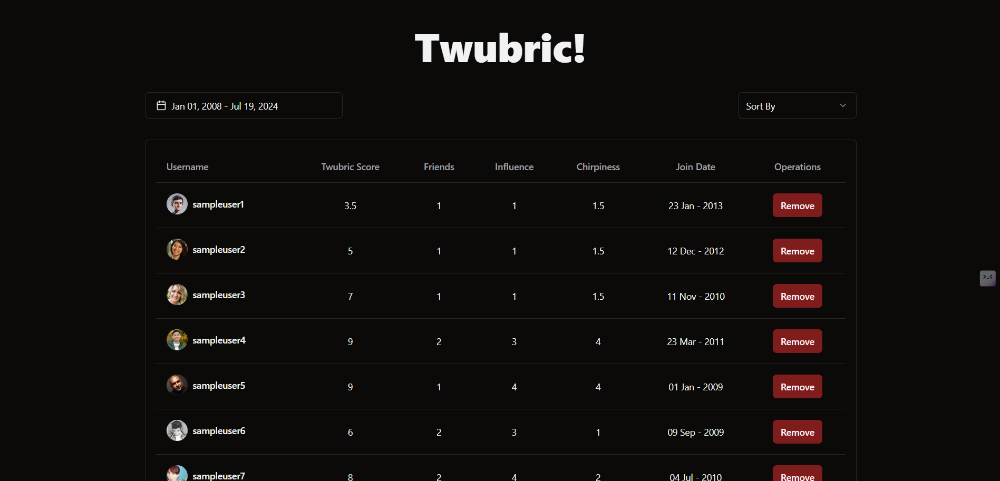

# Assignment Exhibyte Solution - Frontend Developer (React Js)

This application is built using React, TypeScript, ShadCn, and Tailwind CSS.

## Features

1. **Table View:** Display user data in a tabular format.
2. **Date Range Filter:** Filter users based on their join date using a date range picker.
3. **Sorting:** Sort users based on different criteria like total score, friends, influence, and chirpiness.
4. **Remove User:** Remove a user from the list.

